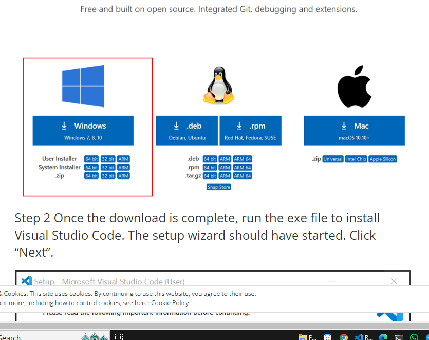
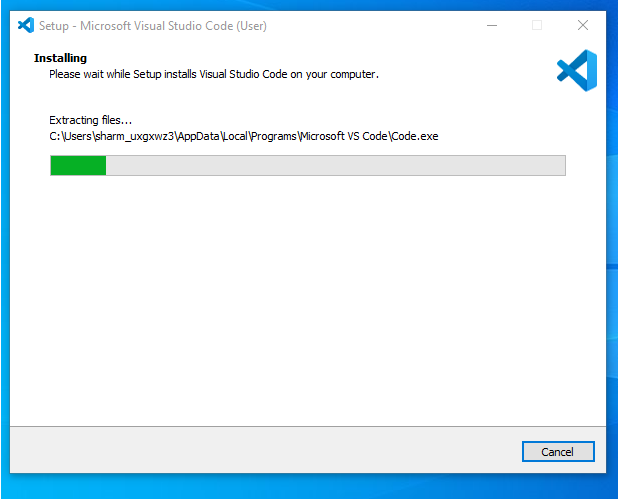

# SE-Assignment-5
Installation and Navigation of Visual Studio Code (VS Code)
 Instructions:
Answer the following questions based on your understanding of the installation and navigation of Visual Studio Code (VS Code). Provide detailed explanations and examples where appropriate.

 Questions:

1. Installation of VS Code:
   - Describe the steps to download and install Visual Studio Code on Windows 11 operating system. Include any prerequisites that might be needed.

STEPS
1. Visit the Visual Studio Code Website

2. Download the Installer

3. Run the Installer 

4. Setup Wizard

5. License Agreement -read and accept the licence agreement.

6. Select Location and folder  where you want to install vs code and click next.

7. Select Additional Tasks
     Create a desktop icon
     Add to PATH
     Register Code as an editor for supported file types
    Click Next

8. Install

PREQUISITIES
Operating System
  - Windows 11 or a compatible version of Windows.
  - Disk Space
  -Administrator Privileges
  - You may need administrative privileges to install software on your system.

2. First-time Setup:
   - After installing VS Code, what initial configurations and settings should be adjusted for an optimal coding environment? Mention any important settings or extensions.

   Settings Sync
   Theme and Appearance
   Customize the Font
   Enable auto Save
   Install pretteir code formatter
   Install live server extension and debugger extension

3. User Interface Overview:
   - Explain the main components of the VS Code user interface. Identify and describe the purpose of the Activity Bar, Side Bar, Editor Group, and Status Bar.

   1. Activity Bar
Provides quick access to different views and controls in VS Code.
Located at The vertical bar on the far left side of the window    
Icons
Explorer: (File icon) Opens the Explorer view for navigating files and folders in your workspace.
Search: (Magnifying glass icon) Opens the Search view to find and replace text within your project.
Source Control: (Branch icon) Integrates version control features (e.g., Git) for managing code changes and repositories.
Run and Debug: (Play icon) Opens the Run and Debug view to start debugging sessions and manage configurations.
Extensions: (Square icon) Opens the Extensions view to browse, install, and manage extensions.
Customization: You can add or remove icons from the Activity Bar by right-clicking and selecting or deselecting the desired views.
2. Side Bar
Located at the right of the Activity Bar.
Displays various panels depending on the selected view from the Activity Bar.
Panels:
Explorer: Shows the directory structure of your workspace, allowing you to open and manage files and folders.
Search: Allows you to search for and replace text within your project.
Source Control: Displays version control information, staged changes, and commit history.
Run and Debug: Provides controls and information for debugging your application, including breakpoints and variables.
3. Status bar located at the horizontal bar at the bottom of the window and displays information about the current workspace, file, and editor state, as well as providing quick access to various settings and command.

4. Command Palette:
   - What is the Command Palette in VS Code, and how can it be accessed? Provide examples of common tasks that can be performed using the Command Palette.

   The Command Palette in Visual Studio Code is a powerful tool that allows you to access and execute a wide range of commands and settings quickly andprovides a centralized place to perform various tasks without navigating through menus.
   Tasks include;
   Keyboard Shortcut
   Changing the Color Theme
   Opening a Terminal
   Running a Specific 
   Formatting Code

5. Extensions in VS Code:
   - Discuss the role of extensions in VS Code. How can users find, install, and manage extensions? Provide examples of essential extensions for web development.

   To Enhance functionality by adding new features, languages, themes, debuggers, and tools to VS Code.
   EXAMPLES
   Prettier: Code formatter.
   ESLint: JavaScript linting.
   Live Server: Local development server with live reload.
   Debugger for Chrome: Debug JavaScript code in Chrome.
   IntelliSense for CSS class names in HTML: CSS class name completion.
   Auto rename tag for html Js css and tags .

6. Integrated Terminal:
   - Describe how to open and use the integrated terminal in VS Code. What are the advantages of using the integrated terminal compared to an external terminal?

   Opening Ctrl+`` (backtick) or View > Terminal`.
   Running Commands
   Tool Integration
   Debugging

   ADVANTAGES
   Access terminal commands without leaving VS Code.
   Seamless interaction with VS Code tasks and extensions.
   Faster workflow with split views and quick access.

7. File and Folder Management:
   - Explain how to create, open, and manage files and folders in VS Code. How can users navigate between different files and directories efficiently?

   Creating Files and Folders
    Right-click in the Explorer view or use the command palette (Ctrl+Shift+P), select "New File" or "New Folder".
   Opening Files and Folders
    Use Ctrl+O to open files or Ctrl+K Ctrl+O to open folders
   Renaming and Deleting
    Right-click on a file or folder in the Explorer view to rename or delete it.
   Switching Between Files
     Use Ctrl+Tab to cycle through recently opened files
   Navigating Directories:
     Use the Explorer view (Ctrl+Shift+E) to browse and navigate through directories

8. Settings and Preferences:
   - Where can users find and customize settings in VS Code? Provide examples of how to change the theme, font size, and keybindings.
   
   Open Settings,Use the search bar at the top of the Settings view to find specific settings by name.
   Changing the Theme
    Open Settings search for "Color Theme", and select a theme from the list.
   Adjusting Font Size
    Open Settings search for "Font Size", and modify the Editor: Font Size setting.
   Customizing Keybindings
    Open Settings search for "Keybindings", and click on Open Keyboard Shortcuts.

9. Debugging in VS Code:
   - Outline the steps to set up and start debugging a simple program in VS Code. What are some key debugging features available in VS Code?

   Install Required Extensions
   Open project and Set Breakpoints
   Configure Debugging Launch Configuration
   Start Debugging
  KEY DEBUGGING FEATURES INCLUDE;
   Breakpoints
   Variable Watching
   Call Stack Navigation
   Debug Console
   Conditional Breakpoints

10. Using Source Control:
    - How can users integrate Git with VS Code for version control? Describe the process of initializing a repository, making commits, and pushing changes to GitHub.

    Install Git
    Open Your Project
    Initialize Git Repository
    Stage and Commit Changes
    Push Changes to Remote Repository
    Branching and Merging
 Open the integrated terminal and execute git init to initialize the repository locally. Next stage files for committing using git add .to add all files orgit add filename for specific files. Commit changes with git commit -m "Initial commit". Use git remote add origin  repository URL to link your local repository to the remote one then push commits to GitHub with git push -u origin master(replacemaster` with your branch name.

 Submission Guidelines:
- Your answers should be well-structured, concise, and to the point.
- Provide screenshots or step-by-step instructions where applicable.
- Cite any references or sources you use in your answers.
- Submit your completed assignment by 1st July 

